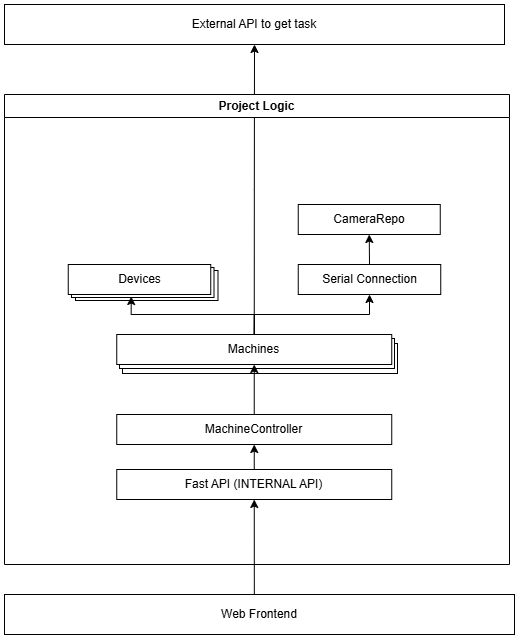

# Project Architecture

## Overview

### 1. Project Architecture

The system is built around the `Machine` class.

- Each `Machine` holds:
    - Multiple references to `Device` objects
    - A single `SerialConnection`
    - A `CameraRepo` (indirectly, via `SerialConnection`)
  
- The `MachineController` serves as the orchestrator:
    - It maintains a list of `Machine` instances
    - It provides high-level control and coordination between machines
    - It exposes control methods to **FastAPI** (in `main.py`)
  
- FastAPI exposes internal APIs to the **frontend web UI** for real-time control.

---
## Core Component Overview

###  Class `Machine` [:material-link:](modules/machine.md)

The `Machine` class encapsulates all functionality related to a single physical machine. It manages:

- A list of `Devices` (e.g., actuators or task points)
- A `SerialConnection` (for communication)
- A `CameraRepo` (for vision-based feedback)

Its functionality include:
- Retrieving tasks from the server
- Executing tasks asynchronously
- Updating task completion status

---

### Class `SerialConnection`  [:material-link:](modules/serialconnection.md)

The `SerialConnection` class manages communication between a serial device (e.g. The Machine) and a camera interface `CameraRepo`. It allows asynchronous sending of custom command sequences over a serial port and can trigger image captures from an attached camera. This class ensures thread-safe interactions using an asyncio.Lock, handles connection recovery in case of failure, and provides logging for all major actions.

---

### Class `Commands` [:material-link:](modules/serialconnection.md#commands)

The Commands class represents a single instruction to be sent to a machine via serial communication. It is used to encode positional movements and special actions, such as triggering a camera capture.

Each instance contains:

- positionX, positionY, positionZ: Axis movement values.
- sleep: Delay (in seconds) to wait after executing the command.
- capture: If True, the command triggers an image capture instead of movement.

The class automatically encodes the instruction into a byte string (command_byte) for transmission over a serial connection.

---

### Class `CameraRepo` [:material-link:](modules/camerarepo.md)
The `CameraRepo` class handles continuous video capture from a connected camera device. It abstracts camera initialization, live frame retrieval, and auto-recovery from capture failures. A background thread is used to continuously update the latest frame in real-time.

**Key Features**:

- Auto-backend fallback: Tries cv2.CAP_DSHOW first; falls back to cv2.CAP_MSMF if needed.
- Threaded frame update: Uses a daemon thread to keep the latest frame updated in memory.
- Thread-safe access: Uses a threading.Lock to prevent race conditions while accessing the frame.
Frame serving: Provides the most recent camera frame to other components (e.g., for processing && display).

---

### Class `Device` [:material-link:](modules/device.md)
The `Device` class represents the individual device on the machine. It operates relative to an initial reference position of each device and stores a queue of `commands` (movement, click, capture, etc.) that can be executed asynchronously via a shared [`SerialConnection`](modules/serialconnection.md).

---

### Class `MachineController` [:material-link:](modules/machinecontroller.md)
The MachineController class manages a list of Machine instances and acts as the main control interface for the system. It provides methods to add, remove, configure, and control machines, as well as expose machine data and actions through FastAPI, enabling web-based control.

It serves as the entry point for interacting with physical machines and their devices in a scalable, centralized way.

*Key Responsibilities*:

- Maintain a registry of all active machines.
- Handle config file I/O (config.json) to persist and restore machine setups.
- Expose machine status and actions to the frontend via FastAPI.
- Facilitate machine operations such as:
    - Start/stop/test machine
    - Manual Machine movement
    - Calibrating machine origin
    - Generating camera preview frames

## Additional Component Overview

### globals.py
Stores global variables and configuration flags that persist across modules. Commonly used for debug toggles (`DEBUG`, `DEBUG_IMAGE_SCAN`) and other shared runtime states.

### logger_config.py
Defines the application's logging configuration. Exposes a reusable `InstanceLogger` utility to create named loggers with standardized formatting and levels across modules.

### utils.py
Contains generic utility/helper functions used throughout the application. These functions support reusable logic and reduce code duplication in the main modules.

